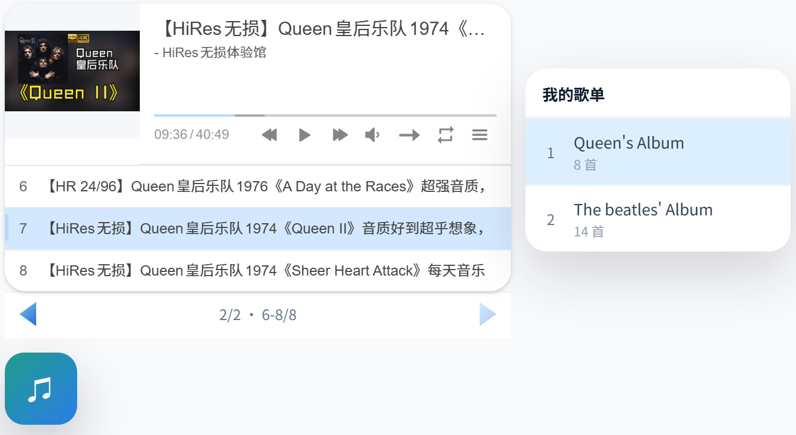
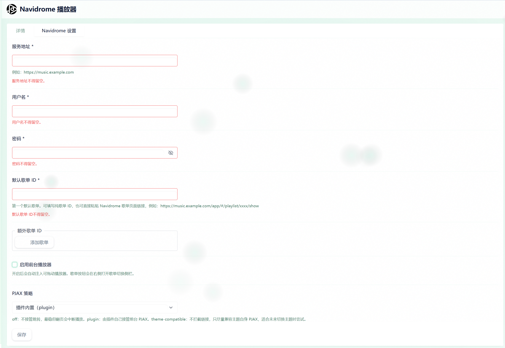

# Navidrome Player for Halo

一款为 Halo 博客集成 Navidrome（Subsonic API）前台音乐播放器的插件，支持悬浮播放、歌单切换与前台连续听歌。

## 简介

`Navidrome Player for Halo` 用于在 Halo 博客前台接入 Navidrome 音乐服务，为访客提供一个可拖动、可展开、支持多歌单切换的悬浮音乐播放器。
界面预览：



适合的使用场景：

- 个人博客接入自建 Navidrome 音乐库
- 在前台展示固定歌单或多个歌单切换
- 为主题补充悬浮音乐播放器能力
- 在不同主题之间按需选择不同 PJAX 策略

## 功能亮点

- 支持通过 Navidrome / Subsonic API 拉取歌单
- 自动转换为前台 APlayer 可直接使用的数据结构
- 支持默认歌单与多个额外歌单切换
- 支持悬浮气泡播放器与可展开播放面板
- 支持播放状态、音量、进度、位置等前端持久化
- 支持 `off / plugin / theme-compatible` 三种 PJAX 策略
- 支持前台匿名访问播放列表接口

## 插件配置


## 安装

### 手动构建并安装

在项目根目录执行：

```powershell
.\gradlew.bat clean build -x test
```

构建完成后，产物默认位于：

```text
build/libs/plugin-navidrome-<version>.jar
```

然后在 Halo 后台上传该插件包即可。

### 通过 GitHub Release 安装

如果仓库已经发布 GitHub Release，可以直接下载 Release Assets 中的插件 JAR，再上传到 Halo。

## 开发

### 本地构建

```powershell
.\gradlew.bat clean build -x test
```

### 项目结构

- `src/main/java/run/halo/app/ext/navidrome/`
  - 插件服务、接口、配置模型与前台注入逻辑
- `src/main/resources/plugin.yaml`
  - 插件元数据
- `src/main/resources/extensions/settings.yaml`
  - Halo 后台配置表单
- `.github/workflows/`
  - CI / Release 工作流

## 许可证

本项目使用 `MIT` 许可证，见 [LICENSE](./LICENSE)。
